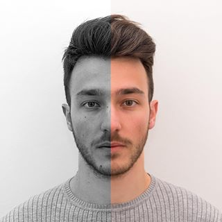

 

My name is *Simone Azeglio*. I am a physicist by training, currently pursuing a M.Sc. in Physics of Complex Systems at the *University of Turin* (Italy) and I am also a Visiting Research Student - working on Neuroscience - at the *University of Ottawa* (Canada). My main interesest lies in understanding the **Learning Process** from two different perspectives: biological and artificial. That's why I've decided to found the *Machine Learning Journal Club (**MLJC**)*, a non-profit organization which aims to fill the gap between students and researchers in Machine & Deep Learning related fields. 

